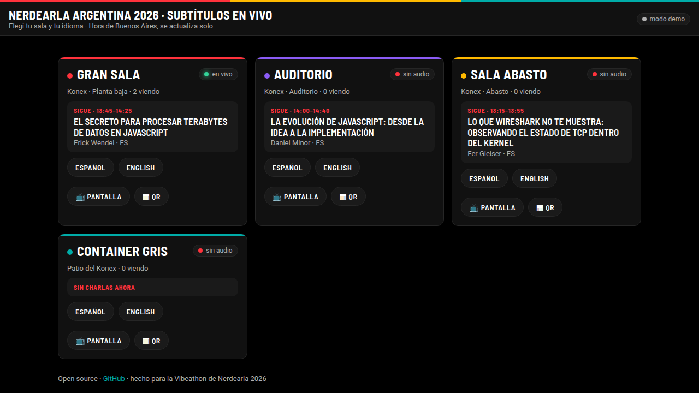
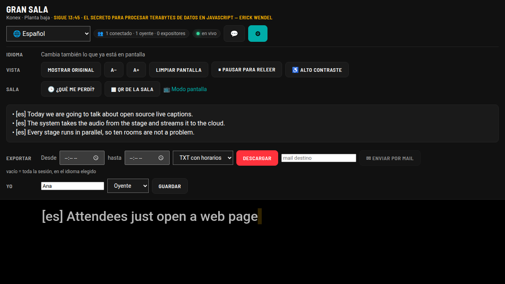
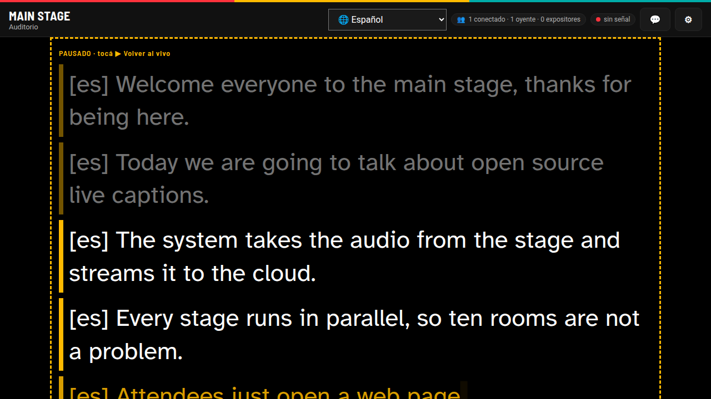
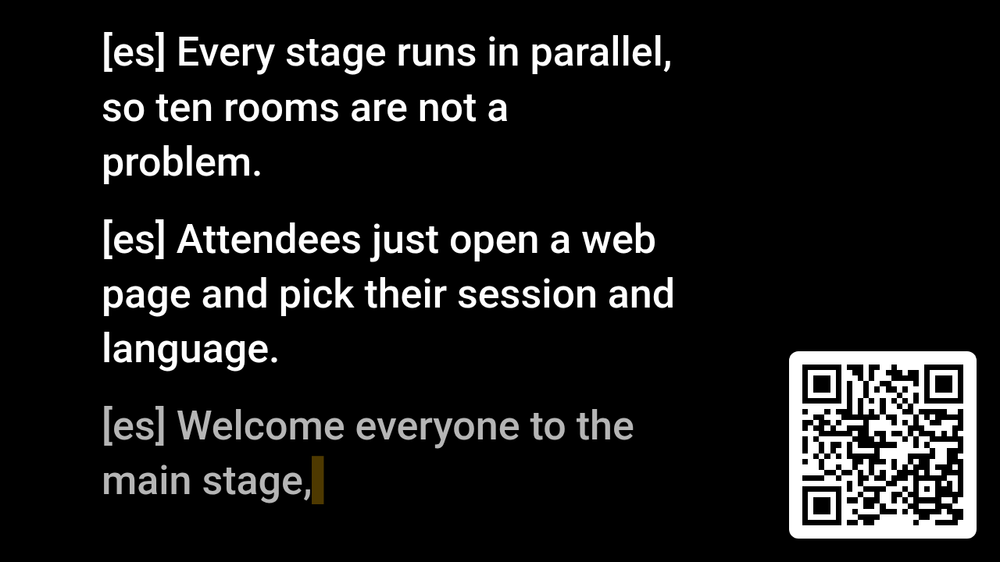

# Live Captions — subtítulos simultáneos open source para conferencias

Transcripción en tiempo real del audio de cada escenario, en el idioma original y traducida (español ⇄ inglés y más), para **muchas sesiones en paralelo**, con una web donde cada persona elige su sesión y su idioma. Construido sobre la **Gemini Live API** (transcripción en streaming) y modelos de texto Gemini para la traducción, con opción de traducir 100 % local con **Gemma** (Ollama).

> Proyecto para la Vibeathon de Nerdearla 2026. Licencia Apache-2.0.

[](https://github.com/lucasmde/nerdearla-live-captions/actions/workflows/ci.yml) · **[Demo pública en vivo](https://nerdearla-live-captions.onrender.com)** · [Video (3 min)](https://youtu.be/35TdPJCY5dw) · [Manual](docs/MANUAL.md) · [Evidencia: latencia, escala y costo](docs/EVIDENCIA.md)

> **Probalo ahora, sin instalar nada:** entrá a https://nerdearla-live-captions.onrender.com, elegí una sala, entrá como *expositor* y apretá **Transmitir micrófono**. Desde otro celular entrá a la misma sala como *oyente* en otro idioma. (Gemini real; es una instancia chica para la demo.)

| Salas reales de Nerdearla 2026 con agenda "ahora / sigue" | Sala con panel ⚙ y "¿Qué me perdí?" |
|---|---|
|  |  |
| **Modo alto contraste + pausa para releer** | **Pantalla de sala con QR** (`?tv=1`) |
|  |  |
| **Panel de producción** (`/admin`) | |
|  | |

```
 escenario 1 ──┐                                   ┌── /s/gran-sala?lang=es   (celulares, pantallas)
 escenario 2 ──┤  audio PCM 16 kHz   ┌──────────┐   ├── /s/gran-sala?lang=en
 escenario N ──┴── WebSocket ──────▶ │  server  │ ──┴── /s/gran-sala?lang=es&overlay=1 (OBS / pantalla de sala)
   (mic / línea / RTMP / OBS)        │ 1 worker │
                                     │ x sesión │──▶ Gemini Live (STT streaming, parciales + finales)
                                     │          │──▶ Gemini Flash / Gemma (traducción por segmento con contexto)
                                     └──────────┘──▶ transcripts/<sesión>.jsonl  →  /api/sessions/<id>/transcript.srt
```

## Qué hace

- **Audio en vivo → subtítulos en tiempo real.** Parciales mientras la persona habla (latencia de unos cientos de ms) y segmentos finales cuando termina la frase.
- **Idioma original + traducción.** Detección automática del idioma; cada segmento final se traduce a todos los idiomas configurados de la sesión (por defecto `es` y `en`, así una charla en inglés sale en español y una en español sale en inglés). Los parciales largos también se traducen para que la vista traducida avance mientras se habla.
- **Muchas sesiones en paralelo.** Cada escenario es una sesión independiente con su propio stream a Gemini. 5, 10 o 30 escenarios son sólo entradas en `sessions.json`; el costo es lineal y el servidor es I/O-bound (un contenedor chico aguanta decenas de sesiones).
- **Vista para la audiencia.** `/` lista las sesiones; `/s/<id>?lang=es` muestra los subtítulos grandes, con selector de idioma, tamaño de letra, opción de ver también el original y un **modo overlay** (`&overlay=1`) con fondo transparente para usar como *browser source* en OBS o en la pantalla de la sala.
- **Tres formas de meter el audio.** Consola web del operador (micrófono o entrada de línea de la notebook del escenario, o el audio de una pestaña), o `tools/ingest.js`, que empuja **cualquier** fuente vía ffmpeg: archivo, RTMP/SRT/HLS del streaming, o dispositivo de captura.
- **Sesiones largas.** La Live API corta a los ~10 min; el servidor rota la sesión antes de eso y ante `GoAway`, abriendo la nueva antes de cerrar la vieja y bufereando el audio, así una charla de 50 min no pierde nada.
- **Transcripción completa.** Cada sesión deja un `.jsonl` y se puede bajar como SRT, VTT, texto o JSON (`/api/sessions/<id>/transcript.srt?lang=es`) para publicar con el video.
- **Panel de producción.** `/admin` muestra por sesión: si llega audio, estado del motor, hace cuánto salió el último subtítulo, latencia de traducción, audiencia conectada y errores.
- **Vocabulario propio.** Nombres de la conferencia, productos y siglas en `sessions.json` (`vocabulary`) para mejorar el reconocimiento.
- **Sin vendor lock-in.** Motores intercambiables: `ENGINE=mock` para probar sin key, `TRANSLATOR=ollama` para traducir con Gemma local.

## Probalo en 5 minutos (sin micrófono ni configuración)

```bash
git clone https://github.com/lucasmde/nerdearla-live-captions && cd nerdearla-live-captions
npm install
echo "GEMINI_API_KEY=tu_key" > .env        # https://aistudio.google.com → Get API key
npm start                                  # http://localhost:8080
# en otra terminal: dos "escenarios" a la vez, uno en inglés y otro en español
node tools/ingest.js --session main --input demo/talk_en.mp3 &
node tools/ingest.js --session workshop-1 --input demo/talk_es.mp3
```

Abrí http://localhost:8080/s/gran-sala?lang=es (charla en inglés vista en español), http://localhost:8080/s/sala-abasto?lang=en (charla en español vista en inglés) y http://localhost:8080/admin (panel de producción). Sin API key, `npm run mock` muestra la interfaz con una charla simulada.

En la vista de audiencia: desplegable de idioma (cambia también lo ya mostrado), **ORIG** para ver la frase original debajo, tamaño de letra, **Limpiar** pantalla y **Exportar** lo mostrado entre dos horarios en TXT/SRT/VTT/JSON.

## Correrlo en 2 minutos

Requisitos: Node 20+ (y ffmpeg si vas a usar `tools/ingest.js`), o Docker.

```bash
git clone https://github.com/<tu-usuario>/nerdearla-live-captions
cd nerdearla-live-captions
npm install
cp .env.example .env         # poné tu GEMINI_API_KEY (https://aistudio.google.com)
cp sessions.example.json sessions.json   # definí tus escenarios
npm start                    # http://localhost:8080
```

Sin API key, para ver la interfaz: `npm run mock` (emite una charla de ejemplo cuando llega audio).

Con Docker:

```bash
cp .env.example .env && cp sessions.example.json sessions.json   # editar ambos
docker compose up -d --build
```

## Mandar el audio del escenario

**Opción A — consola web del operador** (lo más simple): en la notebook del escenario abrí `http://<servidor>:8080/operator/<id>`, elegí la entrada de audio (por ejemplo la salida de la consola de sonido conectada al *line-in*), poné el `INGEST_TOKEN` y apretá *Iniciar*. Dejá la pestaña abierta. También puede capturar el audio de otra pestaña (un Zoom, un stream) con *Capturar audio de una pestaña*.

**Opción B — desde el streaming o cualquier fuente** con ffmpeg:

```bash
# desde el RTMP/SRT que ya va al streaming
node tools/ingest.js --session main --input rtmp://encoder.local/live/stage1 --server ws://captions.local:8080 --token $INGEST_TOKEN
# desde una entrada de audio (Linux / Windows / macOS)
node tools/ingest.js --session main --input alsa:hw:1,0
node tools/ingest.js --session main --input "dshow:audio=Line In (Realtek)"
node tools/ingest.js --session main --input avfoundation::0
# desde un archivo, a velocidad real (demo / pruebas)
node tools/ingest.js --session main --input charla.mp3
```

El protocolo de ingest es trivial (WebSocket binario con PCM 16-bit mono 16 kHz en `ws://host/ws/ingest/<id>?token=…`), así que también se puede integrar desde OBS, un Raspberry Pi al lado de la consola, etc.

## Agenda del evento: salas reales de Nerdearla 2026

`sessions.example.json` trae las **salas reales de Nerdearla Argentina 2026** (Gran sala, Auditorio, Sala Abasto, Container gris) con la **agenda del viernes 25/09** tomada de nerdearla.com: 35 charlas con horario, título, orador e idioma. Con eso el sistema sabe, en hora de Buenos Aires, **qué charla está ahora y cuál sigue** en cada sala (`GET /api/sessions` → `agenda.now / agenda.next`), lo muestra en las tarjetas del index y en la cabecera de la sala con el color de cada sala, y agrega los nombres de los oradores al vocabulario del reconocedor. Para tu evento, reemplazá la agenda en `sessions.json`; los subtítulos y la operación no dependen de ella.

## Configurar las sesiones

`sessions.json`:

```json
{
  "vocabulary": ["Nerdearla", "Kubernetes", "PostgreSQL"],
  "sessions": [
    { "id": "gran-sala", "name": "Gran sala", "room": "Konex", "color": "#FF323C", "sourceLang": "auto", "targetLangs": ["es", "en"],
      "agenda": [{ "day": "2026-09-25", "start": "13:45", "end": "14:25", "title": "El secreto para procesar terabytes de datos en JavaScript", "speaker": "Erick Wendel", "lang": "es" }] },
    { "id": "stage-2", "name": "Stage 2",    "room": "Sala B",    "sourceLang": "en",   "targetLangs": ["es", "en", "pt"] }
  ]
}
```

- `sourceLang`: `auto` (detección, recomendado si hay charlas en varios idiomas) o un código BCP-47 fijo (`en`, `es`) para mayor precisión.
- `targetLangs`: idiomas que la audiencia puede elegir. Si el idioma detectado coincide con uno de ellos, ese subtítulo es la transcripción literal.

Variables de entorno: ver [`.env.example`](.env.example). Las más importantes: `GEMINI_API_KEY`, `INGEST_TOKEN` (protege los endpoints de ingest), `TRANSCRIBE_MODEL`, `TRANSLATE_MODEL`, `TRANSLATOR` (`gemini` | `ollama` | `none`).

## Manual de operación

El paso a paso para producción y operadores de escenario (instalación, sesiones, operación durante el evento, OBS, exportación, problemas frecuentes) está en [docs/MANUAL.md](docs/MANUAL.md). Video demo: ver la entrega en Devpost.

## Despliegue para una conferencia (guía)

1. **Servidor.** Cualquier VM chica (1 vCPU / 1 GB alcanza para ~10 sesiones) con Docker. Poné un reverse proxy con TLS (Caddy: `reverse_proxy localhost:8080`) porque la consola del operador necesita HTTPS para acceder al micrófono, y los WebSockets pasan sin configuración extra.
2. **Sesiones.** Un `id` por escenario en `sessions.json`. Reiniciá el contenedor al cambiarlo.
3. **Audio.** Por escenario, una notebook con la consola del operador conectada a la mesa de sonido (o un `ingest.js` apuntando al RTMP del streaming). Probá 5 minutos antes de la primera charla y mirá el medidor de nivel.
4. **Audiencia.** Imprimí un QR a `https://captions.tuconf.org/s/<id>?lang=es` por sala; en la pantalla lateral de la sala, un browser en `…&overlay=1&fs=48`.
5. **Después.** Bajá los SRT de cada sesión para subirlos con los videos.

**Costos (orden de magnitud).** Transcripción en streaming + traducción por segmento con un modelo *flash-lite*: unos pocos dólares por hora de escenario. Ver precios vigentes en https://ai.google.dev/pricing. Con `TRANSLATE_PARTIALS=0` se reduce el número de llamadas de traducción.

## 100 % local con Gemma

La traducción puede correr sin salir del edificio: `TRANSLATOR=ollama OLLAMA_MODEL=gemma3:4b` (o `gemma3:12b` si hay GPU) con Ollama en la misma red. El reconocimiento de voz local (por ejemplo `whisper.cpp` / `faster-whisper` en streaming) entra por la misma interfaz de motor (`server/engines/`) y está en la hoja de ruta.

## Arquitectura

- `server/index.js` — HTTP (estáticos + API) y WebSockets (`/ws/audience/<id>`, `/ws/ingest/<id>`).
- `server/session.js` — pipeline de una sesión: audio → transcriptor → segmentos → traductor → hub + log.
- `server/engines/gemini-transcribe.js` — cliente Live API (`gemini-3.5-transcribe-live`): parciales (`interimInputTranscription`), finales (`inputTranscription`), rotación de sesión y reconexión.
- `server/engines/translate.js` — traducción por segmento con contexto de las últimas frases (Gemini `generateContent` u Ollama).
- `server/hub.js` — fan-out a la audiencia con buffer de replay para quien entra tarde.
- `public/` — audiencia (`index.html`, `viewer.html`), operador (`operator.html`, `pcm-worklet.js`).
- `tools/ingest.js` — ffmpeg → WebSocket.

Protocolo hacia la audiencia (JSON): `history`, `partial {text, lang, tr}`, `final {segment}`, `translation {segId, lang, text}`, `status`.

## Sala: cuentas, chat, mail e idiomas a pedido

- **Un solo lugar para todo**: la sala `/s/<id>` tiene el panel ⚙ con idioma, vista, exportación por rango horario (TXT/SRT/VTT/JSON), identidad y, para expositores, la transmisión del micrófono.
- **Idioma a pedido**: cualquier espectador elige entre 30 idiomas; si la sesión no lo traducía, el servidor lo agrega en caliente y rellena las últimas frases.
- **Cuentas con Google o GitHub** (nombre y foto, lista de conectados oyentes/expositores, expositores por lista de mails o dominio), entrada como invitado con nombre obligatorio, cierre de sesión.
- **Chat de la sala** con emojis, **audios** (mantener 🎙), **levantar la mano ✋**: el expositor da la palabra y, mientras alguien la tiene, nadie más escribe hasta que la cierra. Control de flood; se guarda junto con la transcripción.
- **Calidad en vivo** en la cabecera: latencia de conexión, nivel de voz del escenario y retraso de subtítulos, actualizado cada 3 s.
- **Modo día / noche**, tamaño de letra, alto contraste y "mostrar original" se recuerdan por dispositivo. Cerrar sesión / cambiar de nombre desde ⚙.
- **Envío por mail** de la transcripción de un período (SMTP o Resend).
- **¿Qué me perdí?**: resumen con IA de lo dicho hasta ahora, en el idioma del espectador, para quien llega tarde.
- **Pausar para releer** (congela la pantalla y vuelve al vivo) y **modo alto contraste** (Atkinson Hyperlegible, letra grande, últimas líneas resaltadas) pensado para personas sordas o con baja visión; respeta `prefers-reduced-motion`.
- **QR de la sala** en el index, en el panel y en `/api/sessions/<id>/qr.svg`; **modo pantalla** `?tv=1` para el proyector: subtítulos grandes + QR para que la gente lo escanee.
- **Detección de "sin señal"**: si llega audio pero está por debajo de −50 dBFS durante 20 s (cable o consola muteados), la sala y `/admin` lo avisan antes de que la audiencia lo note.

Todo opcional y configurado por variables de entorno; ver `docs/MANUAL.md` §8.

## Integraciones de producción

- **Prometheus / Grafana**: `GET /metrics` (viewers, audio en vivo, nivel dBFS, sin señal, segmentos, traducciones, errores, latencia de traducción, edad del último subtítulo).
- **vMix / OBS texto / LED**: `GET /api/sessions/<id>/now.txt?lang=es` devuelve el último subtítulo como texto plano; `now.json` agrega estado y hora. Además del overlay transparente (`/s/<id>?lang=es&overlay=1`).
- **Despliegue en un clic**: [`render.yaml`](render.yaml) (Render Blueprint), [`railway.json`](railway.json), [`deploy/cloudrun.sh`](deploy/cloudrun.sh) (Cloud Run) y [`deploy/kubernetes.yaml`](deploy/kubernetes.yaml), además de `docker compose up`.

## Pruebas, CI y números

```bash
npm test                                   # unit + end-to-end + features (servidor real en modo simulado), 13 pruebas
node tools/bench.js --sessions 10 --viewers 50 --seconds 45   # carga: 10 escenarios × 500 espectadores
```

Medido (2 vCPU): 10 sesiones × 50 espectadores → **2.100 mensajes/s**, fan-out p95 **2 ms**, **4 % CPU**, **119 MB RAM**. Con Gemini real: traducción disponible **≤ 2,7 s (p95)** después de la frase final. Detalle y cómo reproducirlo en [docs/EVIDENCIA.md](docs/EVIDENCIA.md). Las pruebas corren en GitHub Actions en cada push.

## Roadmap

- STT local (whisper.cpp) como motor alternativo.
- Audio traducido (doblaje en vivo) con `gemini-*-live-translate` como canal opcional de audio para la audiencia.
- Panel de administración para crear sesiones sin reiniciar.
- Diarización de oradores en paneles.

## Licencia

Apache License 2.0 — ver [LICENSE](LICENSE).

---

## English summary

Open-source real-time captions for multi-stage conferences. Each stage's audio (browser console, line-in, or any ffmpeg source such as the RTMP feed) is streamed as 16 kHz PCM to a Node server that runs one Gemini Live transcription session per stage, translates every finalized segment (and long partials) into the configured languages with a Gemini text model — or locally with Gemma via Ollama — and fans the captions out over WebSockets to an audience page where anyone picks their session and language (`/s/<id>?lang=en`), including an OBS-ready transparent overlay mode. Sessions are rotated before the provider's 10-minute cap so long talks are seamless; transcripts are stored and exportable as SRT. Deploy with `docker compose up`; see the guide above.
